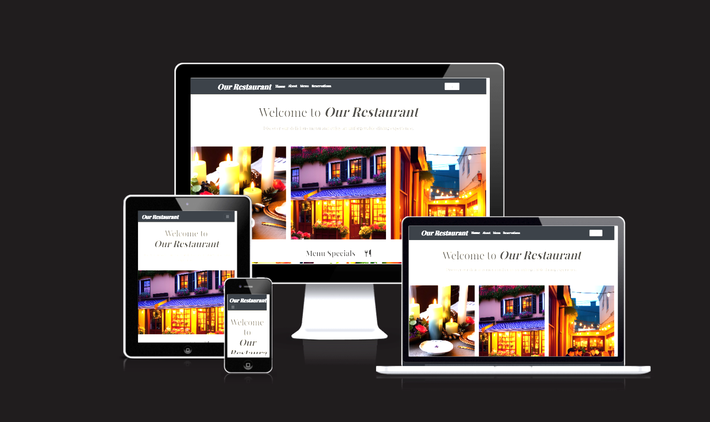

<h1>Welcome to Restaurant Website</h1>

# [Our Restaurant](https://forgottenit-restaurant.herokuapp.com/)

## Purpose of the project

## User Stories

## Functionality

## Entities Relationship Diagram

## Design
- google maps - api key in env.py 
- help_text and headings using forms and models for styling consistant headings, errors and help_text
# Log off after 30 mins of inactivity
SESSION_COOKIE_AGE = 30 * 60

# Log off if browser closed
SESSION_EXPIRE_AT_BROWSER_CLOSE = True

Login button on login page
### Reservation Form

- Radio Tags, targeted by Javascript to stay coloured when selected
- Custom error message using "inspect" to match Validation error if time selected is on the day of booking but earlier than the current time. Tested by adding time to Time_choices and ensuring error displayed.
### Models

### Forms
- Used min max numbers on forms party size so that users can not select unser 1 or over 6, this is also on the models validator but it adds an ease of use to the user having arrows to select party size

## Testing

### AUTOMATED TESTS
 - There was an issue originally when trying to run the automated tests as this project is using the free tier of ElephantSQL Django could not run tests on the postgres as to run tests it creates a Database which is not possible in this tier. To get around this and test the project I used the sqlite database. This involved ammending the settings with an "if 'test' in sys.argv:" condition to use sqlite, so if test was inputted in the command line such as python3 manage.py test, the database (db) was sqlite, then an else to reference the ElephantSQL database for everything else. Obviously the limitations of this were that the postgres db may act differently, but for the purpose of the tests involved, this seemed the best solution. Other attempts involved things such as functions and imports like from django.test.utils import override_settings, or "if os.environ.get('SQLITE_FOR_TEST') == 'True':" use sqlite else use postgres, then "export SQLITE_FOR_TEST=True" in the CLI, but then you had to use "unset SQLITE_FOR_TEST" in the CLI to revert back to postgres, where sqlite was only required for the tests I used the sys.argv method as it prevented using the wrong database for migrations etc. It involved using "import sys" at the top of the settings file.
 
 - ERROR Handlers for Errors 403 (403 Forbidden error) 404 (404 Not Found error) and 500 (500 Internal Server Error) were created in the "customers" views.py. These errors then lead to the respective HTML files for each inside the "templates" folder. The tests tested the automated responses, and also for the views in customer, I also manually tested these views by simulating page not found, trying to access a booking of another user and using:
    def simulate_500(request):
        raise Exception("Something went wrong") to simulate a 500 response, then using "simulate-500" in the address bar and checking the template was as hoped for.
 - Automated tests in the customer app also involved checking the response status codes for Index and About, that they returned 200(OK) when accessed and whether their respective templates were used. 

 - To run the tests I used python3 manage.py test __APP_NAME__ or python3 manage.py test to run all tests.

 - To test coverage of Tests, I pip installed coverage.py
    - pip install coverage

    - Then ran tests and collected Coverage
        - coverage run --source='.' manage.py test

    - To display the coverage report I ran
        - coverage report

Coverage Report Results

Module | statements | missing | excluded | coverage
-- | -- | -- | -- | --
customers/__init__.py | 0 | 0 | 0 | 100%
customers/admin.py | 1 | 0 | 0 | 100%
customers/apps.py | 4 | 0 | 0 | 100%
customers/migrations/__init__.py | 0 | 0 | 0 | 100%
customers/models.py | 1 | 0 | 0 | 100%
customers/tests.py | 37 | 0 | 0 | 100%
customers/urls.py | 7 | 0 | 0 | 100%
customers/views.py | 23 | 3 | 0 | 87%
env.py | 9 | 0 | 0 | 100%
login/__init__.py | 0 | 0 | 0 | 100%
login/admin.py | 1 | 0 | 0 | 100%
login/apps.py | 4 | 0 | 0 | 100%
login/forms.py | 8 | 0 | 0 | 100%
login/migrations/__init__.py | 0 | 0 | 0 | 100%
login/models.py | 1 | 0 | 0 | 100%
login/tests.py | 34 | 0 | 0 | 100%
login/urls.py | 3 | 0 | 0 | 100%
login/views.py | 33 | 3 | 0 | 91%
manage.py | 12 | 2 | 0 | 83%
menu/__init__.py | 0 | 0 | 0 | 100%
menu/admin.py | 4 | 0 | 0 | 100%
menu/apps.py | 4 | 0 | 0 | 100%
menu/forms.py | 6 | 0 | 0 | 100%
menu/migrations/0001_initial.py | 5 | 0 | 0 | 100%
menu/migrations/0002_rename_menuitems_menuitem.py | 4 | 0 | 0 | 100%
menu/migrations/0003_auto_20230416_1555.py | 5 | 0 | 0 | 100%
menu/migrations/0004_alter_menuitem_category.py | 5 | 0 | 0 | 100%
menu/migrations/0005_alter_menucategory_name.py | 4 | 0 | 0 | 100%
menu/migrations/0006_alter_menucategory_name.py | 4 | 0 | 0 | 100%
menu/migrations/0007_auto_20230417_1547.py | 6 | 0 | 0 | 100%
menu/migrations/__init__.py | 0 | 0 | 0 | 100%
menu/models.py | 19 | 0 | 0 | 100%
menu/tests.py | 50 | 0 | 0 | 100%
menu/urls.py | 3 | 0 | 0 | 100%
menu/views.py | 34 | 4 | 0 | 88%
reservations/__init__.py | 0 | 0 | 0 | 100%
reservations/admin.py | 3 | 0 | 0 | 100%
reservations/apps.py | 4 | 0 | 0 | 100%
reservations/forms.py | 71 | 4 | 0 | 94%
reservations/migrations/0001_initial.py | 5 | 0 | 0 | 100%
reservations/migrations/0002_author_book.py | 4 | 0 | 0 | 100%
reservations/migrations/0003_auto_20230323_1448.py | 4 | 0 | 0 | 100%
reservations/migrations/0004_auto_20230326_1532.py | 4 | 0 | 0 | 100%
reservations/migrations/0005_auto_20230326_1548.py | 4 | 0 | 0 | 100%
reservations/migrations/0006_auto_20230326_1549.py | 5 | 0 | 0 | 100%
reservations/migrations/0007_auto_20230326_1600.py | 6 | 0 | 0 | 100%
reservations/migrations/0008_reservation_status.py | 4 | 0 | 0 | 100%
reservations/migrations/0009_reservation_created_on.py | 5 | 0 | 0 | 100%
reservations/migrations/0010_alter_reservation_special_requests.py | 4 | 0 | 0 | 100%
reservations/migrations/0011_reservation_user.py | 6 | 0 | 0 | 100%
reservations/migrations/0012_alter_reservation_user.py | 6 | 0 | 0 | 100%
reservations/migrations/0013_alter_reservation_created_on.py | 5 | 0 | 0 | 100%
reservations/migrations/0014_alter_reservation_created_on.py | 4 | 0 | 0 | 100%
reservations/migrations/0015_alter_reservation_name.py | 4 | 0 | 0 | 100%
reservations/migrations/0016_auto_20230417_1547.py | 4 | 0 | 0 | 100%
reservations/migrations/0017_alter_reservation_email.py | 4 | 0 | 0 | 100%
reservations/migrations/0018_auto_20230418_2034.py | 4 | 0 | 0 | 100%
reservations/migrations/__init__.py | 0 | 0 | 0 | 100%
reservations/models.py | 15 | 1 | 0 | 93%
reservations/tests.py | 102 | 3 | 0 | 97%
reservations/urls.py | 3 | 0 | 0 | 100%
reservations/views.py | 73 | 37 | 0 | 49%
restaurant/__init__.py | 0 | 0 | 0 | 100%
restaurant/asgi.py | 4 | 4 | 0 | 0%
restaurant/settings.py | 60 | 1 | 0 | 98%
restaurant/urls.py | 3 | 0 | 0 | 100%
restaurant/wsgi.py | 4 | 4 | 0 | 0%
staff/__init__.py | 0 | 0 | 0 | 100%
staff/admin.py | 1 | 0 | 0 | 100%
staff/apps.py | 4 | 0 | 0 | 100%
staff/context_processors.py | 3 | 0 | 0 | 100%
staff/migrations/__init__.py | 0 | 0 | 0 | 100%
staff/models.py | 1 | 0 | 0 | 100%
staff/tests.py | 31 | 0 | 0 | 100%
staff/urls.py | 3 | 0 | 0 | 100%
staff/views.py | 29 | 0 | 0 | 100%
Total | 827 | 66 | 0 | 92%

### MANUAL TESTS
 - DATABASE issue - Make migrations to both databases, debug = TRUE sqlite, otherwise postgres
 - TESTED filling special requests all the way across
 - TESTED errors and displays for errors
 - TESTED links, added if statements to check if user logged in or not
 - FontAwsome installed in new link as would not work in preinstalled version
 - TIMEZONE ISSUES
 - TESTED CAPACITY, created test booking at set time, i.e. 1pm on 20th April for 48 people, tested they couldn't make another booking themselves that day. Tested another user trying to make a booking at 1pm for 3 people ( This would exceed capacity as capacity is set at 50 people.) Displayed correct error. Also, each booking has a set duration of 1hr. So tested that bookings that would lead to excess capacity were also checked. i.e. If a booking was made at 12.45pm for 3 people, this would also exceed capacity as when the 48 people who had already booked for 1pm came in, capacity would be exceeded. So the latest booking preceeding the 48people at 1pm, would be 12pm, as booking durations are 1hr. Also tested bookings for 1.15pm -1.45pm for 3 people. These all exceeded bookings and displayed what capacity was available, like in the previous errors. Also checked at 2pm where capacity would be zero and booking was accepted. These cases were all tested for edited bookings also, i.e. if someone had a booking for 3pm that day, they couldn't edit it to a time where capacity would be exceeded. Finally, also checked that bookings for 1 or 2 people were accepted at all these times, where capacity would be reached but not exceeded and all worked correctly.
- TESTED USERS can't access StaffTeam templates by inserting in address bar, likewise for User not viewing others bookings.

## Initial Setup

For this Project a Template provided by CodeInstitute was used -[Template](https://github.com/Code-Institute-Org/gitpod-full-template)

- Click "Use this Template" then "Create a new repository"
- Give the repository a name then click "Create repository from template"
### DJANGO AND LIBRARIES
- Install Django and Libraries:
 - pip3 install 'django<4' gunicorn (This installs the LTS (Long Term Support) version of Django and is therefore preferable to use over a beta version)

- Set up the project to use Cloudinary and PostgreSQL:
    - Install Django and PostgreSQL libraries:
        - pip3 install dj_database_url==0.5.0 psycopg2 (Returns a Django database connection dictionary & 
          PostgreSQL database adapter)
    - Install Cloudinary Libraries:
        pip3 install dj3-cloudinary-storage

- Create local requirements:
    - pip3 freeze --local > requirements.txt

- Created Project:
    - django-admin startproject __PROJ_NAME__ . 

- Created Required Apps:
    - python3 manage.py startapp __APP_NAME__
    - Each APP is then added to INSTALLED_APPS in settings.py

- Changes are Migrated as needed, but initially as:
    - python3 manage.py migrate
    - Then python3 manage.py manage migrations followed by python3 manage.py migrate

- The server is then tested:
    - python3 manage.py runserver

### ElephantSQL
- Create an External Database:
    - Log in to ElephantSQL
    - Create New Instance
        - Name the project
        - select "Tiny Turtle" (free version)
        - Click Select Region and choose the nearest Data Center
        - Click "Review", then click "Create instance"
    - Click on the newly created project in the dashboard
    - Copy the URL - "postgres://...."

### HEROKU APP 
- Login to the Heroku App:
    - Click "New", then "Create new app"
    - Under App name - name the app, with a unique name
    - Choose your region
    - Click Create app
    - On your new app, click "Settings"
    - Click Reveal Config Vars
    - Add a Config Var called DATABASE_URL and give it the value from ElephantSQL ("postgres://....") and 
      click Add

### Cloudinary
- Login to Cloudinary
- On the Dashboard under API Environment variable, copy the CLOUDINARY_URL (copy from after the "=" symbol) 
    - The Settings needed and how to hide your private key are explained in the "Link Databases and Hide KEYS" and "Settings.py Setup" sections below. 
    - Once the project is complete, run "python manage.py collectstatic" in the CLI then type yes when prompted to store media and static in "Cloudinary". 
### Link Databases and Hide KEYS
- Create an env.py in the top-level directory (This is for the SECRET_KEY in Django and also the URL's for ElephantSQL and Cloudinary, so they are not pushed to Git and visible to others)
- At the top of the env.py file import os
- Create Environment Variables for DATABASE_URL(ElephantSQL URL), SECRET_KEY(Django Secret Key) and CLOUDINARY_URL (Cloudinary URL)
- Set these equal to their corresponding values with - os.environ["VARIABLE_NAME"] = "Corresponding Variable"
- Do the same in Config Vars on Heroku, so the config vars on Heroku should be DATABASE_URL, SECRET_KEY, CLOUDINARY_URL
- Add DISABLE_COLLECTSTATIC = 1 on HEROKU also, for the development period, this is removed at project completion.
- In Heroku Config VARS add PORT = 8000
- Check .gitignore 
    - add *.sqlite3 to hide your database

    -   core.Microsoft*
        core.mongo*
        core.python*
        env.py
        __pycache__/
        *.py[cod]
        node_modules/
        .github/
        cloudinary_python.txt
        *.sqlite3

### Settings.py Setup
- Before Deployment make sure Debug = False as if not, secret information could be displayed to users 
  unwittingly
- In settings.py import os, import dj_database_url and import env
    - import os
      import dj_database_url

      if os.path.isfile("env.py"):
        import env

- Hide the SECRET_KEY variable
    - SECRET_KEY = os.environ.get('SECRET_KEY')

- Comment out the DATABASES Section and Add:
    DATABASES = {
   'default': dj_database_url.parse(os.environ.get("DATABASE_URL"))
}

- Add Cloudinary Libraries to INSTALLED_APPS:
    - INSTALLED_APPS = [
    …,
    'cloudinary_storage',
    'django.contrib.staticfiles',
    'cloudinary',
    …,
    ] - The order is important

- Instruct DJANGO to use Cloudinary to Store Media and Static Files
    - STATIC_URL = '/static/'

      STATICFILES_STORAGE = 'cloudinary_storage.storage.StaticHashedCloudinaryStorage'
      STATICFILES_DIRS = [os.path.join(BASE_DIR, 'static'), ]
      STATIC_ROOT = os.path.join(BASE_DIR, 'staticfiles')

      MEDIA_URL = '/media/'
      DEFAULT_FILE_STORAGE = 'cloudinary_storage.storage.MediaCloudinaryStorage'

- Link file to templates directory in Heroku (Under BASE_DIR)
    - TEMPLATES_DIR = os.path.join(BASE_DIR, 'templates')

- Set the TEMPLATES DIR in TEMPLATES [...]
    - TEMPLATES = [
            {
                …,
                'DIRS': [TEMPLATES_DIR],
            …,
                    ],
                },
            },
        ]

- Add the App name to ALLOWED_HOSTS
    - ALLOWED_HOSTS = ["forgottenit-restaurant.herokuapp.com", "localhost"]

### Top-level directories

- Create media, static and templates folders in the top-level directory

- Create a Procfile
    - In Procfile add web: gunicorn restaurant.wsgi

- Migrate changes
    - python3 manage.py migrate

- Push Changes to Git
    - git add .
      git commit -m “Commit Comment”
      git push

### Heroku Deployment
- In Heroku, on the app go to the Deploy section
- Click GitHub  in the "Deployment method" section
- Under the "Connect to GitHub" section, type in the repository name in the "repo-name" field then click 
  "Search"
- Once your repository name comes up underneath, click "Connect"
- Scroll down to the Manual deploy section and click "Deploy Branch"
- Then at the top of the page click "Open app"

## Crispy Forms
- pip install django-crispy-forms

- Add to settings.py:
    - INSTALLED_APPS = [
    ...
    "crispy_forms",
    'crispy_bootstrap5',
    '...
    
    - Note above that crispy_forms has Double Quotation marks, this is important.
]   
   -  Add TEMPLATE packs:
      CRISPY_ALLOWED_TEMPLATE_PACKS = "bootstrap5"
      CRISPY_TEMPLATE_PACK = "bootstrap5"

- Insert  at top of HTML page

## Alert Messages

- Imported constants as messages to display Login/ Sign up/ Log Out success messages using:
from django.contrib.messages import constants as messages
then amending the settings.py to add the message tags and styling:
MESSAGE_TAGS = {
        messages.DEBUG: 'alert-info',
        messages.INFO: 'alert-info',
        messages.SUCCESS: 'alert-success',
        messages.WARNING: 'alert-warning',
        messages.ERROR: 'alert-danger',
    }
The message div was then targeted to close after 2.5 Seconds using the set Timeout function. 
- This method was learned from the CodeInstitute classes.

## Getting Started
- Once all the requirements are met, to initialise the project type:
    - django-admin startproject __PROJ_NAME__ into the CLI (replace __PROJ_NAME__  with the name you want to give your project)
    - Test it's working with python3 manage.py runserver and open the relevant PORT, usually 8000 (You are prompted to open the Port in GitHub, although, if not, you can click PORTS in the CLI Heading and select the relevant PORT) 
- Then create your apps by typing the following into the CLI 
    - python manage.py startapp __APP_NAME__ (replace __APP_NAME__  with the name you want to give your project) Then add the app to INSTALLED_APPS in settings.py in the project folder.
- Then create a "Super User" who has Admin priveledges by typing:
    - python manage.py createsuperuser into the CLI and follow the prompts

### Create Staff User 

- PURPOSE: To allow staff to add menu items, view add, edit and delete bookings.
- Go to the Users section in the admin panel (click "Change" next to "Users" under "AUTHENTICATION AND AUTHORIZATION").
- Click on "Add User" in the top right corner to create a new user, or click on an existing user to edit their details.
- Fill in the required fields (username, password, etc.) and check the "Staff status" checkbox to grant the user staff permissions. 
- Click "Save" to create or update the user with staff status.

### Create Staff Group and Permissions
- On Admin Panel, in the top left corner click Groups.
- Type the name of the Group you want to create and click Add Group in the top right. (Be careful naming the Group, for example, Django has a method to check Staff Status, is_staff, so naming it something more unique may be less confusing, i.e. "RestaurantStaff" etc.)
- Select the permissions you want to give the group, these will depend on the apps you have created
- Click Save

- You then need to add the Users you want to this group:
 - Go back to the Admin home page
 - Click Users in the top left, then select the user you want to add to a group
 - Scroll down to the groups section, select the Group and click the arrow right to add to Chosen Groups Box
 - Save Changes.
 - Note that Admin has all permissions, though if you are creating unique templates for staff, you could add the admin to the new group, or in views, check if user is "Group name or superuser", both options may have their advantages, but I chose to keep them separate. Also, permissions are additive, in that, if admin is added, it doesn't lose permissions that are not included in the new group, so Users could be members of multiple groups, i.e. Waiters, Chefs etc. in the case of this project. 

### CREATE MENU CATEGORIES AND ITEMS
FORM Also

## Technology used

1. GitPod for writing the code
2. Python as the programming language
3. Heroku for deployment
4. Code Instistute Terminal for displaying finished product
5. https://pep8ci.herokuapp.com/ CI Python Linter for testing code
6. # DJANGO, CLOUDINARY, ElephantSQL....CRISPY FORMS JQuery, Google Fonts, FontAwesome

## Imports used from Python Library

## Constraints

# Learning and Future Improvements

## Learning

collect static! 

## Future improvements  

## Deployment
<h3>GitPod<h3>

<h3>Heroku</h3>

## Acknowledgements 

 - Images [Dream Ai](https://dream.ai/)