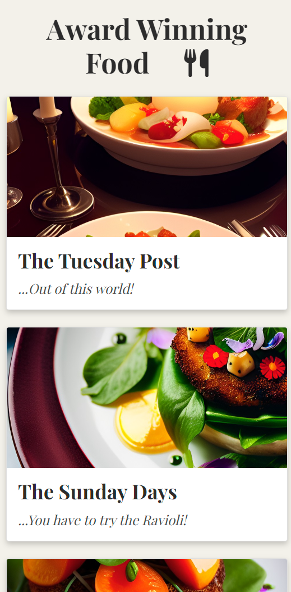

<h1>Welcome to Restaurant Website</h1>

# [Our Restaurant](https://forgottenit-restaurant.herokuapp.com/)

## Purpose of the Project

The main purpose of this project is to create a website for a fictional restaurant (Our Restaurant) that effectively showcases the restaurant's offerings and provides a nice user experience for both customers and staff. The website is designed to be visually appealing and responsive on different devices, ensuring a pleasant browsing experience for all users.

The project leverages databases to store and manage information related to reservations and menu items, enabling robust CRUD (Create, Read, Update, and Delete) functionality. This allows customers to make, view, edit, and cancel reservations, as well as view the latest menu items. Staff, on the other hand, can efficiently handle bookings, update menu items, and manage restaurant-related data.

By implementing the features outlined in the user stories and ensuring data security and privacy, this project aims to create a comprehensive and user-friendly platform that serves the needs of both customers and staff, ultimately enhancing the overall experience associated with the restaurant.

## User Stories
[Project](https://github.com/users/Forgottenit/projects/3/views/1)
 - KANBAN BOARD

#### Customers (Site User)

- As a Site User, I want to be able to view the site so that I can learn about the restaurant.
- As a Site User, I want to view the menu so that I can decide what to order.
- As a Site User, I want to see the restaurant's location so that I can plan my visit.
- As a Site User, I want the site to be visually appealing and responsive on different devices to ensure a pleasant browsing experience.
- As a Site User, I want to make reservations so that I can secure a table for my desired time.
- As a Site User, I want to view, edit, and delete my reservations to manage my bookings.
- As a Site User, I want to receive feedback about my reservations, such as confirmation or cancellation notices.
- As a Site User, I want my reservation data to be secure and not accessible by other users for privacy reasons.

#### Staff (Site Owner)

- As a Site Owner, I want to be able to handle bookings efficiently to manage the restaurant's reservations.
- As a Site Owner, I want to inform users about overbookings to maintain customer satisfaction.
- As a Site Owner, I want to have defensive forms that prevent incorrect or inappropriate data entry.
- As a Site Owner, I want to be able to add, edit, and delete forms to manage restaurant-related data.
- As a Site Owner, I want to be able to add, edit, and delete menu items so that I can keep the menu updated.
- As a Site Owner, I want the updated menu items to be displayed on the site so that customers can see the latest offerings.

## Functionality

The Restaurant project is designed to address the user stories of both customers (site users) and staff (site owners). Various technologies and packages are used to create a user-friendly and feature-rich web application, which help achieve the desired functionalities.

### Customers (Site User)

* **View the site and learn about the restaurant**: Django, a Python web framework, is used to build the site structure and create templates for displaying content. The site is broken down into Home, About, Menu and Reservations.
* **View the menu**: The menu items are stored in a database and displayed on the site using Django templates.
* **See the restaurant's location**: Google Maps API is integrated into the site to display the restaurant's location.
* **Visually appealing and responsive site**: Bootstrap and CSS are used to create a responsive, uniques and visually appealing layout, which works well on different devices. Site templates and functioinality according to screen size, with some text and images on smaller screens to make the view less cluttered, notably, images on the carousel on the home page, navigation bar styling ("hamburger" button on smaller screens), text hidden on the about section and table layout of bookings on smaller screens changes to a horizontal view, using data labels to signify headings from the larger table. 
* **Make, view, edit, and delete reservations**: Django forms and views are used to handle the creation, modification, and deletion of reservations. The reservation data is stored in a database, sqlite on development and ElephantSQL on production versions, and utilizes CRUD (Create, Read, Update and Delete) operations. Bookings are offered at 15 minute intervals using radio buttons on the reservation form. Helper text is utilised to explain the fields, and descriptions, such as advising the customer to ring the Restaurant if the party size is greater than 6, with a fictional phone number, added to create realism. Warning signs are displayed using a custom modal if errors occur, or if capacity reached at the requested time. If the party size requested is larger than available capacity, the available capacity is displayed to the user. Once bookings are completed or if they have a preexisting booking, the user Navigation bar displays a "My reservations" section, which displays the user bookings in a table format, that is displayed differently dependent on device size. Here the user can edit or delete their booking. Editing bringing them back to a form submission, and deletion displaying a confirmation modal to prevent accidental deletion. Also, users are prevented from "Double Booking" on a day, on purpose as a way of bypassing party size and by accident, if they have entered an incorrect date. If it is attempted, the form is not submitted and the user is shown a modal that displays the fact they already have a booking on that day. 
* **Receive feedback about reservations**: Sendgrid-django package is used to send email confirmations and notifications regarding reservations. The email is sent in HTML as a stylised version and text, this is to account for users that may not have the technology to view the email in the HTML format. The email is sent for confirmed bookings, and if the booking is edited a new email is sent with the new booking.
* **Secure reservation data**: Django's built-in authentication system ensures that user reservation data is secure and not accessible by other users. Custom Error handlers are utiliesd to display the error if a User attempts to view another users data. 

### Staff (Site Owner)

- **Handle bookings efficiently**: The Django admin interface is customized to allow site owners to manage reservations easily. Data is stored in sqlite in development and ElephantSQL for production. Django views are used to manipulate the data. 
- **Inform users about overbookings**: Reservation logic checks for overbookings and displays appropriate error messages to users. Capacity is set to 50 customers at a time. Each booking is set to last for 1 hour. As bookings are not set to hourly sittings i.e. 5pm-6pm, 6pm-7pm etc. capacity has to be taken into account for the duration of bookings. For example, if the restaurant was at capacity from 5.30pm to 6.30pm, a user should not be able to book at 5.15pm as the capacity would be exceeded once the users come at 5.30pm. Due to this, when making a booking, capacity is checked for the duration of the booking, i.e. 5.15pm, 5.45pm, 6pm etc. as to prevent a user causing an over capacity situation. This depends on party size, start of bookings, order of bookings (i.e. the time the booking was created, not the time the booking was for, with the booking created earliest getting the booking, not the booking for the earliest time slot), If users exceed capacity for their booking they are informed, also, if the booking was for say, 3 people and capacity remaining was 2, they are displayed the remaining capacity as they may wish to ammend their booking to a smaller party size. 
- **Defensive forms**: Django forms are used to validate and clean user input, preventing incorrect or inappropriate data entry. Forms also use validators, such as min max values to ensure this and to aid the user. For example, on party size the user is able to scroll up and down the party size but it is limited to a minimum of 1 and maximum of 6. User status also plays a part, with Admin or Staff decorators created so staff or Admin are able to view the bookings, edit or delete them. This was acheived by creating a super user and also a group called staff, that was given certain privledges. It was a design choice to not add super user (Admin) to the staff group, as they already have the privledges. Also, ny keeping them separate it would allow for clearer and easier customisation in the future, i.e. templates for only staff and templates for only admin etc.
- **Add, edit, and delete forms and menu items**: Django admin interface is utilized to manage forms and menu items, with CRUD operations supported for both. Other than the functions mentioned in the Site User functionality, Staff and admin are also able to manipulate the menu items. When a staff or Admin logs in, they are shown a different navigation bar and templates than a regular user. The template for bookings opens first, with the display for "Todays" bookings displayed first, with two sections, one for future, and one for past bookings. The Future bookings are then broken down by month, to ease navigation, and an add reservation button is displayed on the page. From here, staff and admin are able to view edit and delete all bookings, this is for example, to be used if a booking was made over the phone or cancelled over the phone etc. or if bookings needed to be edited etc. The other template unique to staff is the menu, which is broken down by category, then each item is then editable or deletable. Editing the item leads to a form, designed to display each section clearly, with validation incorporated, so, for example, Categories (Sides, Desserts etc.) are displayed in a drop down menu. There is also an add item option, that displays the form. These changes are then rendered on the HTML for regular users or non users. 

These functionalities, achieved through the use of various technologies and packages, ensure that the Restaurant project caters to the needs of both site users and site owners, addressing their respective user stories. Key components include:

- **Django**: A web framework that serves as the base of the project, enabling efficient, faster development of the website and its features. Utilising it's models and form attributes and also it's login and database structures to aid development.
- **Bootstrap**: A responsive front-end framework that adds to the websites visual appwal and adapts to different devices, utilising its comprehensive library.
- **sendgrid-django**: A package that integrates SendGrid with Django, allowing for easy email handling and notifications related to reservations, with Site User emailed confirmation of created and edited reservations in both a HTML and text format, so the email is visible on different technologies.
- **Cloudinary**: A cloud-based image and video management platform used for storing and serving media and static files, such as menu item images, css etc. This is due to the ephemeral nature of the Hosting application, Heroku.
- **Heroku**: A cloud platform that enables easy deployment and hosting of the web application.
- **Google Maps**: An API used to display the restaurant's location and provide easily accessible directions for customers. The location, due to the fictitious nature of the project, was set to a famous popular park in Dublin City, Ireland.
- **Dream AI**: A package used for generating realistic images for the project.

Additional packages and dependencies used in the project include:

- asgiref
- cloudinary==1.32.0
- crispy-bootstrap5
- dj-database-url
- dj3-cloudinary-storage
- Django==3.2.18
- django-allauth
- django-cloudinary-storage
- django-crispy-forms
- gunicorn
- oauthlib
- psycopg2
- PyJWT
- python-dotenv
- python-http-client
- python3-openid
- pytz
- requests-oauthlib
- sendgrid==3.6.5
- social-auth-app-django
- social-auth-core
- sqlparse

These packages and technologies work together to provide a comprehensive and feature-rich experience for both customers and staff, enabling efficient management of reservations, menu items, and other restaurant-related data.

## Entities Relationship Diagram

- Image Showing relationship between enitities on project

## DESIGN IMAGES

### HOME PAGE

#### Image Home page Large screen carousel
  

#### Image Home page small screen carousel
  

#### Image Showing tiles on small screen
  

#### Image Showing tiles on small screen
  

#### Image Showing tiles on small screen
  

#### Image Showing Map on Home page
  

#### Image Showing Map on Home page
  

### ABOUT PAGE

#### Image Showing About Page
  

#### Image Showing About Page on small screen
  

### SIGN UP/ LOGIN

#### Image Showing Sign Up page
  

#### Image Showing Sign Up page
  

### BOOKINGS

#### Booking form
  

#### Booking form Calendar
  

#### Booking form Time
  

#### Booking date error
  

#### Booking date modal error
  

#### Booking Modal
  

### Booking Views

#### Client Bookings
  

#### Client Bookings
  

#### Confirm Deletion of Booking
  

### Staff Views

#### Staff Menu
  

#### Staff Menu
  

#### Edit Menu
  

#### Staff Reservations view
  

#### Staff Reservations view
 

## Testing

### AUTOMATED TESTS
 - There was an issue originally when trying to run the automated tests as this project is using the free tier of ElephantSQL Django could not run tests on the postgres as to run tests it creates a Database which is not possible in this tier. To get around this and test the project I used the sqlite database. This involved ammending the settings with an "if 'test' in sys.argv:" condition to use sqlite, so if test was inputted in the command line such as python3 manage.py test, the database (db) was sqlite, then an else to reference the ElephantSQL database for everything else. Obviously the limitations of this were that the postgres db may act differently, but for the purpose of the tests involved, this seemed the best solution. Other attempts involved things such as functions and imports like from django.test.utils import override_settings, or "if os.environ.get('SQLITE_FOR_TEST') == 'True':" use sqlite else use postgres, then "export SQLITE_FOR_TEST=True" in the CLI, but then you had to use "unset SQLITE_FOR_TEST" in the CLI to revert back to postgres, where sqlite was only required for the tests I used the sys.argv method as it prevented using the wrong database for migrations etc. It involved using "import sys" at the top of the settings file.
 
 - ERROR Handlers for Errors 403 (403 Forbidden error) 404 (404 Not Found error) and 500 (500 Internal Server Error) were created in the "customers" views.py. These errors then lead to the respective HTML files for each inside the "templates" folder. The tests tested the automated responses, and also for the views in customer, I also manually tested these views by simulating page not found, trying to access a booking of another user and using:
    def simulate_500(request):
        raise Exception("Something went wrong") to simulate a 500 response, then using "simulate-500" in the address bar and checking the template was as hoped for.
 - Automated tests in the customer app also involved checking the response status codes for Index and About, that they returned 200(OK) when accessed and whether their respective templates were used. 

 - To run the tests I used python3 manage.py test __APP_NAME__ or python3 manage.py test to run all tests.

 - To test coverage of Tests, I pip installed coverage.py
    - pip install coverage

    - Then ran tests and collected Coverage
        - coverage run --source='.' manage.py test

    - To display the coverage report I ran
        - coverage report

### Testing Overview

This project includes a variety of tests to ensure its functionality and reliability. The following is a brief summary of some of these tests. Please note that this is not an exhaustive list of all tests in the project.

1. **About View Test**: Tests the 'About' view by checking the status code and ensuring the correct template is used.
2. **Error Template Test**: Verifies that the appropriate error messages are displayed for 404 and 403 errors.
3. **Sign Up Test**: Confirms the sign-up process works correctly by checking the status code after a successful sign-up.
4. **Authentication View Test**: Ensures that the login and logout views work as expected, including checking for proper redirects and user authentication.
5. **Staff Authorization Test**: Verifies that the `is_staffteam_or_admin` function accurately identifies staff members and administrators.
6. **Staff Menu Test**: Tests the staff menu view to ensure it displays menu items correctly.
7. **All Reservations Test**: Checks the 'All Reservations' view to confirm that it displays reservations as expected.

### Coverage Report Results

Module | statements | missing | excluded | coverage
-- | -- | -- | -- | --
customers/__init__.py | 0 | 0 | 0 | 100%
customers/admin.py | 1 | 0 | 0 | 100%
customers/apps.py | 4 | 0 | 0 | 100%
customers/migrations/__init__.py | 0 | 0 | 0 | 100%
customers/models.py | 1 | 0 | 0 | 100%
customers/tests.py | 37 | 0 | 0 | 100%
customers/urls.py | 7 | 0 | 0 | 100%
customers/views.py | 23 | 3 | 0 | 87%
env.py | 9 | 0 | 0 | 100%
login/__init__.py | 0 | 0 | 0 | 100%
login/admin.py | 1 | 0 | 0 | 100%
login/apps.py | 4 | 0 | 0 | 100%
login/forms.py | 8 | 0 | 0 | 100%
login/migrations/__init__.py | 0 | 0 | 0 | 100%
login/models.py | 1 | 0 | 0 | 100%
login/tests.py | 34 | 0 | 0 | 100%
login/urls.py | 3 | 0 | 0 | 100%
login/views.py | 33 | 3 | 0 | 91%
manage.py | 12 | 2 | 0 | 83%
menu/__init__.py | 0 | 0 | 0 | 100%
menu/admin.py | 4 | 0 | 0 | 100%
menu/apps.py | 4 | 0 | 0 | 100%
menu/forms.py | 6 | 0 | 0 | 100%
menu/migrations/0001_initial.py | 5 | 0 | 0 | 100%
menu/migrations/0002_rename_menuitems_menuitem.py | 4 | 0 | 0 | 100%
menu/migrations/0003_auto_20230416_1555.py | 5 | 0 | 0 | 100%
menu/migrations/0004_alter_menuitem_category.py | 5 | 0 | 0 | 100%
menu/migrations/0005_alter_menucategory_name.py | 4 | 0 | 0 | 100%
menu/migrations/0006_alter_menucategory_name.py | 4 | 0 | 0 | 100%
menu/migrations/0007_auto_20230417_1547.py | 6 | 0 | 0 | 100%
menu/migrations/__init__.py | 0 | 0 | 0 | 100%
menu/models.py | 19 | 0 | 0 | 100%
menu/tests.py | 50 | 0 | 0 | 100%
menu/urls.py | 3 | 0 | 0 | 100%
menu/views.py | 34 | 4 | 0 | 88%
reservations/__init__.py | 0 | 0 | 0 | 100%
reservations/admin.py | 3 | 0 | 0 | 100%
reservations/apps.py | 4 | 0 | 0 | 100%
reservations/forms.py | 71 | 4 | 0 | 94%
reservations/migrations/0001_initial.py | 5 | 0 | 0 | 100%
reservations/migrations/0002_author_book.py | 4 | 0 | 0 | 100%
reservations/migrations/0003_auto_20230323_1448.py | 4 | 0 | 0 | 100%
reservations/migrations/0004_auto_20230326_1532.py | 4 | 0 | 0 | 100%
reservations/migrations/0005_auto_20230326_1548.py | 4 | 0 | 0 | 100%
reservations/migrations/0006_auto_20230326_1549.py | 5 | 0 | 0 | 100%
reservations/migrations/0007_auto_20230326_1600.py | 6 | 0 | 0 | 100%
reservations/migrations/0008_reservation_status.py | 4 | 0 | 0 | 100%
reservations/migrations/0009_reservation_created_on.py | 5 | 0 | 0 | 100%
reservations/migrations/0010_alter_reservation_special_requests.py | 4 | 0 | 0 | 100%
reservations/migrations/0011_reservation_user.py | 6 | 0 | 0 | 100%
reservations/migrations/0012_alter_reservation_user.py | 6 | 0 | 0 | 100%
reservations/migrations/0013_alter_reservation_created_on.py | 5 | 0 | 0 | 100%
reservations/migrations/0014_alter_reservation_created_on.py | 4 | 0 | 0 | 100%
reservations/migrations/0015_alter_reservation_name.py | 4 | 0 | 0 | 100%
reservations/migrations/0016_auto_20230417_1547.py | 4 | 0 | 0 | 100%
reservations/migrations/0017_alter_reservation_email.py | 4 | 0 | 0 | 100%
reservations/migrations/0018_auto_20230418_2034.py | 4 | 0 | 0 | 100%
reservations/migrations/__init__.py | 0 | 0 | 0 | 100%
reservations/models.py | 15 | 1 | 0 | 93%
reservations/tests.py | 102 | 3 | 0 | 97%
reservations/urls.py | 3 | 0 | 0 | 100%
reservations/views.py | 73 | 37 | 0 | 49%
restaurant/__init__.py | 0 | 0 | 0 | 100%
restaurant/asgi.py | 4 | 4 | 0 | 0%
restaurant/settings.py | 60 | 1 | 0 | 98%
restaurant/urls.py | 3 | 0 | 0 | 100%
restaurant/wsgi.py | 4 | 4 | 0 | 0%
staff/__init__.py | 0 | 0 | 0 | 100%
staff/admin.py | 1 | 0 | 0 | 100%
staff/apps.py | 4 | 0 | 0 | 100%
staff/context_processors.py | 3 | 0 | 0 | 100%
staff/migrations/__init__.py | 0 | 0 | 0 | 100%
staff/models.py | 1 | 0 | 0 | 100%
staff/tests.py | 31 | 0 | 0 | 100%
staff/urls.py | 3 | 0 | 0 | 100%
staff/views.py | 29 | 0 | 0 | 100%
Total | 827 | 66 | 0 | 92%

### Manual Tests

The following manual tests were conducted to ensure the proper functioning of the Restaurant project:

- **Database**: Migrations were made to both SQLite (when `DEBUG = True`) and PostgreSQL databases. Tests were run on the SQLite as Django could not create and destroy/pull down instances in the PostgreSQL database on ElephantSQL due to the tier being used.  
- **Special requests**: Filling the special requests field was tested manually.
- **Error handling**: Errors and error displays were tested to ensure proper handling and messaging. HTML templates were created for Errors 403, 404 and 500, these were then simulated, by trying to access "Forbidden" requests, "Not Found" and for the 500 error, a link was created to simulate a 500 error and tested. 
- **Links**: All links in the HTML were tested, including checks for user authentication and the appropriate display of content based on user login status. As Login Status and User status give different template views, these were all tested extensively.
- **FontAwesome**: Installed a new link for FontAwesome, as it was not working with the preinstalled version.
- **Timezone issues**: Timezone-related issues were identified and resolved.
- **Capacity management**: A series of tests were performed to ensure that the reservation system properly handles capacity constraints. This included testing:
  - Multiple bookings on the same day and overlapping times.
  - Booking modifications that could lead to excess capacity.
  - Accepting bookings when capacity is reached but not exceeded.
- **Access control**: Tests were conducted to ensure that users cannot access unauthorized content, such as StaffTeam templates and other users' bookings, by manipulating the address bar.

These manual tests helped to confirm the correct functioning of various features, including links, error handling, displays, defensiveness, ease of use, menu displays, and CRUD functionality for reservations and menu items.

## Initial Setup

For this Project a Template provided by CodeInstitute was used -[Template](https://github.com/Code-Institute-Org/gitpod-full-template)

- Click "Use this Template" then "Create a new repository"
- Give the repository a name then click "Create repository from template"
### DJANGO AND LIBRARIES
- Install Django and Libraries:
 - pip3 install 'django<4' gunicorn (This installs the LTS (Long Term Support) version of Django and is therefore preferable to use over a beta version)

- Set up the project to use Cloudinary and PostgreSQL:
    - Install Django and PostgreSQL libraries:
        - pip3 install dj_database_url==0.5.0 psycopg2 (Returns a Django database connection dictionary & 
          PostgreSQL database adapter)
    - Install Cloudinary Libraries:
        pip3 install dj3-cloudinary-storage

- Create local requirements:
    - pip3 freeze --local > requirements.txt

- Created Project:
    - django-admin startproject __PROJ_NAME__ . 

- Created Required Apps:
    - python3 manage.py startapp __APP_NAME__
    - Each APP is then added to INSTALLED_APPS in settings.py

- Changes are Migrated as needed, but initially as:
    - python3 manage.py migrate
    - Then python3 manage.py manage migrations followed by python3 manage.py migrate

- The server is then tested:
    - python3 manage.py runserver

### ElephantSQL
- Create an External Database:
    - Log in to ElephantSQL
    - Create New Instance
        - Name the project
        - select "Tiny Turtle" (free version)
        - Click Select Region and choose the nearest Data Center
        - Click "Review", then click "Create instance"
    - Click on the newly created project in the dashboard
    - Copy the URL - "postgres://...."

### HEROKU APP 
- Login to the Heroku App:
    - Click "New", then "Create new app"
    - Under App name - name the app, with a unique name
    - Choose your region
    - Click Create app
    - On your new app, click "Settings"
    - Click Reveal Config Vars
    - Add a Config Var called DATABASE_URL and give it the value from ElephantSQL ("postgres://....") and 
      click Add

### Cloudinary
- Login to Cloudinary
- On the Dashboard under API Environment variable, copy the CLOUDINARY_URL (copy from after the "=" symbol) 
    - The Settings needed and how to hide your private key are explained in the "Link Databases and Hide KEYS" and "Settings.py Setup" sections below. 
    - Once the project is complete, run "python manage.py collectstatic" in the CLI then type yes when prompted to store media and static in "Cloudinary". 
### Link Databases and Hide KEYS
- Create an env.py in the top-level directory (This is for the SECRET_KEY in Django and also the URL's for ElephantSQL and Cloudinary, so they are not pushed to Git and visible to others)
- At the top of the env.py file import os
- Create Environment Variables for DATABASE_URL(ElephantSQL URL), SECRET_KEY(Django Secret Key) and CLOUDINARY_URL (Cloudinary URL)
- Set these equal to their corresponding values with - os.environ["VARIABLE_NAME"] = "Corresponding Variable"
- Do the same in Config Vars on Heroku, so the config vars on Heroku should be DATABASE_URL, SECRET_KEY, CLOUDINARY_URL
- Add DISABLE_COLLECTSTATIC = 1 on HEROKU also, for the development period, this is removed at project completion.
- In Heroku Config VARS add PORT = 8000
- Check .gitignore 
    - add *.sqlite3 to hide your database

    -   core.Microsoft*
        core.mongo*
        core.python*
        env.py
        __pycache__/
        *.py[cod]
        node_modules/
        .github/
        cloudinary_python.txt
        *.sqlite3

### Settings.py Setup
- Before Deployment make sure Debug = False as if not, secret information could be displayed to users 
  unwittingly
- In settings.py import os, import dj_database_url and import env
    - import os
      import dj_database_url

      if os.path.isfile("env.py"):
        import env

- Hide the SECRET_KEY variable
    - SECRET_KEY = os.environ.get('SECRET_KEY')

- Comment out the DATABASES Section and Add:
    DATABASES = {
   'default': dj_database_url.parse(os.environ.get("DATABASE_URL"))
}

- Add Cloudinary Libraries to INSTALLED_APPS:
    - INSTALLED_APPS = [
    …,
    'cloudinary_storage',
    'django.contrib.staticfiles',
    'cloudinary',
    …,
    ] - The order is important

- Instruct DJANGO to use Cloudinary to Store Media and Static Files
    - STATIC_URL = '/static/'

      STATICFILES_STORAGE = 'cloudinary_storage.storage.StaticHashedCloudinaryStorage'
      STATICFILES_DIRS = [os.path.join(BASE_DIR, 'static'), ]
      STATIC_ROOT = os.path.join(BASE_DIR, 'staticfiles')

      MEDIA_URL = '/media/'
      DEFAULT_FILE_STORAGE = 'cloudinary_storage.storage.MediaCloudinaryStorage'

- Link file to templates directory in Heroku (Under BASE_DIR)
    - TEMPLATES_DIR = os.path.join(BASE_DIR, 'templates')

- Set the TEMPLATES DIR in TEMPLATES [...]
    - TEMPLATES = [
            {
                …,
                'DIRS': [TEMPLATES_DIR],
            …,
                    ],
                },
            },
        ]

- Add the App name to ALLOWED_HOSTS
    - ALLOWED_HOSTS = ["forgottenit-restaurant.herokuapp.com", "localhost"]

#### Some additional settings
- SESSION_COOKIE_AGE = 30 * 60 To log user off after 30 minutes of inactivity

- SESSION_EXPIRE_AT_BROWSER_CLOSE = True o log user off after Browser Close

### Top-level directories

- Create media, static and templates folders in the top-level directory

- Create a Procfile
    - In Procfile add web: gunicorn restaurant.wsgi

- Migrate changes
    - python3 manage.py migrate

- Push Changes to Git
    - git add .
      git commit -m “Commit Comment”
      git push

### GitHub Deploment
- Navigate to Project
- To launch project type python3 manage.py runserver to launch on local host
### Heroku Deployment
- In Heroku, on the app go to the Deploy section
- Click GitHub  in the "Deployment method" section
- Under the "Connect to GitHub" section, type in the repository name in the "repo-name" field then click 
  "Search"
- Once your repository name comes up underneath, click "Connect"
- Scroll down to the Manual deploy section and click "Deploy Branch"
- Then at the top of the page click "Open app"

## Crispy Forms
- pip install django-crispy-forms

- Add to settings.py:
    - INSTALLED_APPS = [
    ...
    "crispy_forms",
    'crispy_bootstrap5',
    '...
    
    - Note above that crispy_forms has Double Quotation marks, this is important.
]   
   -  Add TEMPLATE packs:
      CRISPY_ALLOWED_TEMPLATE_PACKS = "bootstrap5"
      CRISPY_TEMPLATE_PACK = "bootstrap5"

- Insert  at top of HTML page

## Alert Messages

- Imported constants as messages to display Login/ Sign up/ Log Out success messages using:
from django.contrib.messages import constants as messages
then amending the settings.py to add the message tags and styling:
MESSAGE_TAGS = {
        messages.DEBUG: 'alert-info',
        messages.INFO: 'alert-info',
        messages.SUCCESS: 'alert-success',
        messages.WARNING: 'alert-warning',
        messages.ERROR: 'alert-danger',
    }
The message div was then targeted to close after 2.5 Seconds using the set Timeout function. 
- This method was learned from the CodeInstitute classes.

## Getting Started
- Once all the requirements are met, to initialise the project type:
    - django-admin startproject __PROJ_NAME__ into the CLI (replace __PROJ_NAME__  with the name you want to give your project)
    - Test it's working with python3 manage.py runserver and open the relevant PORT, usually 8000 (You are prompted to open the Port in GitHub, although, if not, you can click PORTS in the CLI Heading and select the relevant PORT) 
- Then create your apps by typing the following into the CLI 
    - python manage.py startapp __APP_NAME__ (replace __APP_NAME__  with the name you want to give your project) Then add the app to INSTALLED_APPS in settings.py in the project folder.
- Then create a "Super User" who has Admin priveledges by typing:
    - python manage.py createsuperuser into the CLI and follow the prompts

### Create Staff User 

- PURPOSE: To allow staff to add menu items, view add, edit and delete bookings.
- Go to the Users section in the admin panel (click "Change" next to "Users" under "AUTHENTICATION AND AUTHORIZATION").
- Click on "Add User" in the top right corner to create a new user, or click on an existing user to edit their details.
- Fill in the required fields (username, password, etc.) and check the "Staff status" checkbox to grant the user staff permissions. 
- Click "Save" to create or update the user with staff status.

### Create Staff Group and Permissions
- On Admin Panel, in the top left corner click Groups.
- Type the name of the Group you want to create and click Add Group in the top right. (Be careful naming the Group, for example, Django has a method to check Staff Status, is_staff, so naming it something more unique may be less confusing, i.e. "RestaurantStaff" etc.)
- Select the permissions you want to give the group, these will depend on the apps you have created
- Click Save

- You then need to add the Users you want to this group:
 - Go back to the Admin home page
 - Click Users in the top left, then select the user you want to add to a group
 - Scroll down to the groups section, select the Group and click the arrow right to add to Chosen Groups Box
 - Save Changes.
 - Note that Admin has all permissions, though if you are creating unique templates for staff, you could add the admin to the new group, or in views, check if user is "Group name or superuser", both options may have their advantages, but I chose to keep them separate. Also, permissions are additive, in that, if admin is added, it doesn't lose permissions that are not included in the new group, so Users could be members of multiple groups, i.e. Waiters, Chefs etc. in the case of this project. 

# Validation

This document outlines the process of validating the code in a Django project using Black for Python, online JSHint for JavaScript, and W3C for HTML and CSS.

## Table of Contents

1. [Python Validation (Black)](#python-validation-black)
2. [JavaScript Validation (Online JSHint)](#javascript-validation-online-jshint)
3. [HTML Validation (W3C)](#html-validation-w3c)
4. [CSS Validation (W3C)](#css-validation-w3c)
5. Lighthouse

## Python Validation (Black)

To use Black for validation, follow these steps:

1. Install the `black` package: pip install black
2. Run `black` on your Python files:
3. Review the changes made by `black` and fix any issues if needed.
4. All issues addressed.

## JavaScript Validation (Online JSHint)

JSHint is a tool that helps detect errors and potential problems in your JavaScript code. To use the online JSHint validator, follow these steps:

1. Visit the [JSHint Online Validator](https://jshint.com/).

2. Copy and paste your JavaScript code into the input area.

3. Click the "Lint" button to start the validation process.

4. Review the validation results and fix any issues.

5. All issues addressed.

## HTML Validation (W3C)

The W3C HTML validator checks the markup validity of HTML documents. To use the W3C HTML validator, follow these steps:

1. Visit the [W3C Markup Validation Service](https://validator.w3.org/).

2. Choose one of the following options to validate your HTML:

   - Enter the URL of your web page
   - Upload your HTML file
   - Copy and paste your HTML code

3. Review the validation results and fix any issues.

4. No issues found.

## CSS Validation (W3C)

The W3C CSS validator checks the validity of CSS stylesheets. To use the W3C CSS validator, follow these steps:

1. Visit the [W3C CSS Validation Service](https://jigsaw.w3.org/css-validator/).

2. Choose one of the following options to validate your CSS:

   - Enter the URL of your CSS file
   - Upload your CSS file
   - Copy and paste your CSS code

3. Review the validation results and fix any issues.

4. No issues found.

---

## Lighthouse

- Lighthouse Score

# Future Improvements

The following is a list of potential enhancements and features that can be added to the project in the future:

1. **Multiple Menus and Sittings**: Add support for different menus and sittings such as lunch, brunch, dinner, and special occasions. This will allow for more flexibility and customization of the reservation system.

2. **Staff Rostering**: Implement a roster option in the staff view, enabling staff members to manage and assign shifts for other employees. This will improve workforce organization and scheduling.

3. **Customer Reviews**: Integrate a review section where customers can leave feedback on their dining experience. This will help the restaurant gain valuable insights and improve its services.

4. **Password Reset Functionality**: Provide an email-based password reset feature for users who have forgotten their login credentials. This will improve user experience and account security.

5. **Takeaway and Delivery Service**: Expand the system to include takeaway and delivery options, allowing customers to place orders online for pickup or home delivery. This will increase revenue and customer convenience.

6. **Integration with Third-Party Services**: Connect the platform with popular third-party services, such as Google Maps for location information, OpenTable for reservation management, and Stripe for payment processing. This will streamline various aspects of the restaurant's operations.

7. **Analytics Dashboard**: Develop a comprehensive analytics dashboard that provides valuable insights into customer behavior, reservation patterns, and overall restaurant performance. This will help the restaurant make data-driven decisions for future improvements.

8. **Mobile App**: Create a mobile app for iOS and Android devices to provide a seamless reservation experience for customers on-the-go. This will increase customer engagement and provide additional channels for reservations.

## Acknowledgements (Excluding requirements)

### For coding help and advice
Simen Daehlin
Rohit Sharma
CodeInstitiute
Stack Overflow

### For content and style
https://ui.dev/amiresponsive? for README image
CodeInstitute
W3Schools.com
pylessons.com
Bootstrap
Django
https://stackoverflow.com/
Lucid.app for ERD